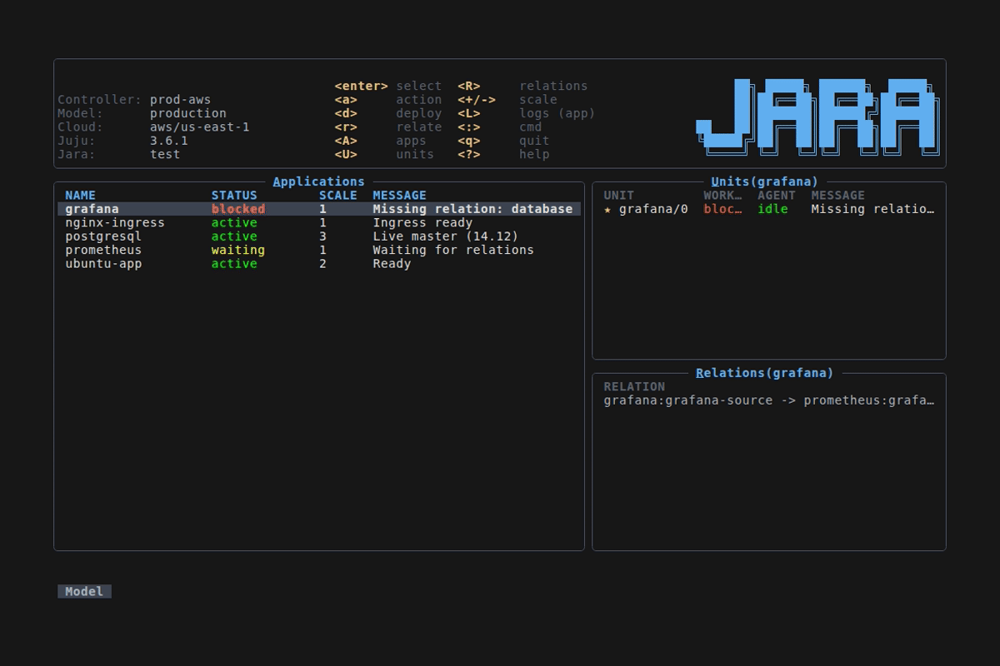

<p align="center">
  <b>jara</b><br>
  <i>A terminal UI for Juju — like k9s, but for your clouds.</i>
</p>

<p align="center">
  <a href="https://github.com/bschimke95/jara/actions/workflows/ci.yml"></a>
  <a href="https://snapcraft.io/jara"></a>
  <a href="https://goreportcard.com/report/github.com/bschimke95/jara"></a>
  <a href="LICENSE"></a>
</p>

<p align="center">
  
</p>

---

## Install

### Snap (recommended)

```
sudo snap install jara
```

### From source

```
go install github.com/bschimke95/jara@latest
```

Or build locally:

```
git clone https://github.com/bschimke95/jara
cd jara
make build
```

Requires **Go 1.25+** and a reachable Juju controller.

## Quick start

```
jara                        # launch the TUI
jara --readonly             # disable write operations
```

Press `?` inside jara to see all key bindings.

## Configuration

Config lives at `~/.jara/config.yaml` (override with `--config` or `JARA_CONFIG_DIR`).
See [`config.example.yaml`](config.example.yaml) for all available options.

## Development

```
make build    # compile
make test     # unit tests
make lint     # golangci-lint
make demo     # regenerate the hero GIF (requires vhs)
```

## License

[AGPL-3.0](LICENSE)
